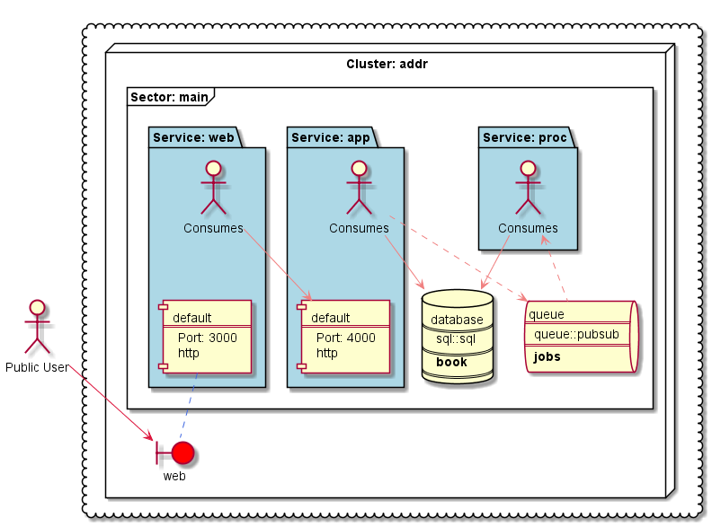

# Berlioz Sample - GCP Address Book

This is a sample application with 3 microservices:
* **WEB**: A web frontend written in Node.js. **WEB** talks to **APP**,
* **APP**: A backend service written in Node.js. **APP** writes to **DB** and sends messages to **JOBS**,
* **PROC**: A backend service written in Node.js. **PROC** takes messages from **JOBS** and makes changes to **DB**,
* **DB**: A SQL Database,
* **JOBS**: A Pub/Sub message queue.

We deploy this application using Berlioz to local computer, and to the cloud as well.  

Run this example, right here, right now inside Katacoda interactive terminal: [https://www.katacoda.com/berlioz/scenarios/first-local-gcp-app](https://www.katacoda.com/berlioz/scenarios/first-local-gcp-app)
